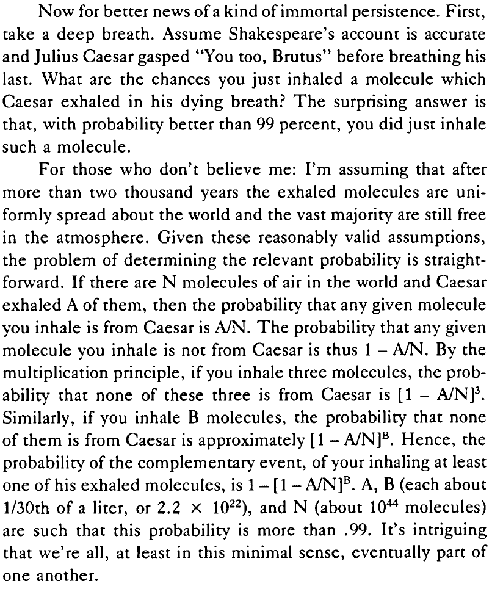

# 03: Problema do aniversário, propriedades {-}

## Vídeo {-}

```{r echo=FALSE, results='asis', out.extra=center()}
embed_yt('LZ5Wergp_PA')
```


## Exercícios do livro (cap. 1) {-}

### 26 {-}

::: {.rmdbox latex=1}

Amostra [com reposição]{.hl} de tamanho $1000$ a partir de uma população de tamanho $1$ milhão. Cada pessoa tem a mesma probabilidade de ser escolhida.

Qual a probabilidade de pelo menos uma pessoa ser escolhida mais de uma vez?

:::

Usando $N = 1.000.000$ e $n = 1.000$:

$$
\begin{aligned}
P &= 1 - P(\text{ninguém escolhido mais de uma vez}) \\
  &= 1 - \frac{\binom{N}{n} \cdot n!}{N^n} \\
  &= 1 - \frac{N}{N} \cdot \frac{N - 1}{N} \cdot \frac{N - 2}{N} \cdot \cdots \cdot \frac{N - n + 1}{N}
\end{aligned}
$$

Na verdade, esta é a mesma distribuição do problema dos aniversários, com $N$ dias e $n$ pessoas.

Para $N$ grande e $n$ pequeno, a probabilidade $P$ de pelo menos uma pessoa ser escolhida mais de uma vez se aproxima de $0$:

```{r echo=FALSE}
maximo <- 6
N <- 10^maximo
n <- 10^(maximo:0)

tibble(
  N = N,
  n = n,
  P = map2_dbl(n, N, ~pbirthday(.x, .y))
) %>% 
  kbl(
    format.args = list(big.mark = '.')
  ) %>% 
  kable_paper(
    c('striped', 'hover'),
    full_width = FALSE
  )
```


### 27 {-}

::: {.rmdbox latex=1}

* Função de *hash* $h(x)$.

* $k$ telefones armazenados em $n$ posições, todas com a mesma probabilidade.

* Qual a probabilidade de colisão?

:::

De novo, `pbirthday(k, n)`.


### 57 {-}

::: {.rmdbox latex=1}

* Existem $10^{44}$ moléculas na atmosfera.

* No seu último suspiro, César respirou $10^{22}$ delas ([sem]{.hl} reposição).

* Você respira $10^{22}$ moléculas agora ([com]{.hl} reposição).

* Qual a probabilidade de que pelo menos uma molécula sua tenha sido de César também?

:::

A resposta é $1 - P(\text{nenhuma molécula sua foi de César})$.

Para calcular $P(\text{nenhuma molécula sua foi de César})$:

* Todas as respiradas possíveis (com reposição, com ordem): $\left( 10^{44} \right)^{\left(10^{22} \right)}$.

* Todas as respiradas sem moléculas de César (com reposição, com ordem): $\left( 10^{44} - 10^{22} \right)^{\left(10^{22} \right)}$.

* Daí,

  $$
  \begin{aligned}
  P(\text{nenhuma molécula sua foi de César}) 
  &=
  \frac{\left( 10^{44} - 10^{22} \right)^{\left(10^{22} \right)}}
  {\left( 10^{44} \right)^{\left(10^{22} \right)}}
  \\
  &= 
  \left( \frac{10^{44} - 10^{22}}{10^{44}} \right)^{(10^{22})}
  \\
  &=
  \left( 1 - \frac{1}{10^{22}} \right)^{(10^{{22}})}
  \\
  &\approx e^{-1}
  \end{aligned}
  $$

* Logo, a probabilidade procurada é aproximadamente

  $$
  1 - e^{-1} \approx `r 1 - exp(-1)`
  $$

* Formulação original em @paulos-1988-innum:

    ```{r echo=FALSE, out.width='60%'}
    
    ```


### 61 {-}

::: {.rmdbox latex=1}

* $n$ passageiros para $n$ assentos.

* Passageiro $k$ inicialmente alocado no assento $k$.

* MAS Passageiro $1$ decide escolher assento ao acaso (cada assento com a mesma probabilidade).

* Então, cada passageiro seguinte se senta no assento inicialmente alocado para ele, se disponível; caso contrário, escolhe um assento ao acaso.

* Qual a probabilidade de que o último passageiro se sente no assento alocado para ele?

:::

#### Possibilidades {-}

O último passageiro só pode se sentar no lugar $1$ ou no lugar $n$.

Aliás, isto é um caso específico de um fenômeno mais geral, Qualquer que seja o valor de $n$:

* O passageiro $3$ nunca fica no assento $2$: ou o passageiro $1$ pegou, ou ficou livre para o passageiro $2$ (que é obrigado a pegá-lo).

* O passageiro $4$ nunca fica nos assentos $2$ nem $3$: ou o passageiro $1$ pegou o assento $3$, ou aconteceu um dos casos acima e o assento $3$ ficou livre para o passageiro $3$ (que é obrigado a pegá-lo).

* O passageiro $5$ nunca fica nos assentos $2$ nem $3$ nem $4$: ou o passageiro $1$ pegou o assento $4$, ou aconteceu um dos casos acima e o assento $4$ ficou livre para o passageiro $4$ (que é obrigado a pegá-lo).

* etc.

* Seguindo o raciocínio, chegamos à conclusão de que o passageiro $n$ só pode ocupar o assento $1$ ou o assento $n$.


#### Probabilidades {-}

* Examinando exemplos com $n \in \{3, 4, 5\}$, a probabilidade parece ser $1/2$.

* Por quê?

* O assento do passageiro $n$ depende da pergunta (no momento em que o passageiro $n$ vai se sentar)

  ["O assento $1$ já foi tomado?"]{.hl}
  
  cuja resposta é oposta à da pergunta 
  
  ["O assento $n$ já foi tomado?"]{.hl}

* Com que probabilidade a resposta a esta última pergunta é sim?

* Em todos os passos anteriores, [como explicado acima em "possibilidades"](#possibilidades), os assentos $1$ e $n$ sempre estão disponíveis para qualquer passageiro que vá escolher um assento ao acaso.

* Como todos os assentos têm a mesma probabilidade de ser escolhidos, a probabilidade de o assento $1$ estar tomado é igual à probabilidade de o assento $n$ estar tomado.

* Logo, a probabilidade de o passageiro $n$ acabar no assento $n$ é $1/2$.


### 62 {-}

::: {.rmdbox latex=1}

**Problema do aniversário com probabilidades diferentes:**

* Seja $\vec p = (p_1, p_2, \ldots, p_{365})$ o vetor das probabilidades de alguém nascer em algum dos dias do ano.

* Seja 

  $$
  e_k(x_1, \ldots, x_n) = 
  \sum_{1 \leq j_1 < j_2 < \cdots < j_k \leq n}
  \!\!\!\!\!\!\!\!\!\!\!\!\!\! x_{j_1} \ldots x_{j_k}
  $$

  o $k$-ésimo [polinômio simétrico elementar]{.hl} sobre as variáveis $x_1, \ldots, x_n$.
  
  Por exemplo,
  $$
  \begin{aligned}
    e_1(x_1, x_2, x_3) &= x_1 + x_2 + x_3 \\
    e_2(x_1, x_2, x_3) &= x_1x_2 + x_1x_3 + x_2x_3 \\
    e_3(x_1, x_2, x_3) &= x_1x_2x_3 \\
  \end{aligned}
  $$

a. Seja $k \geq 2$. Qual a probabilidade de pelo menos uma coincidência de aniversários em termos de $\vec p$ e de um polinômio simétrico elementar?

:::

A probabilidade de [não haver coincidência]{.hl} é a soma das probabilidades de todos os eventos da forma

> [As pessoas $1, 2, \ldots k$ nasceram em dias diferentes $j_1, j_2, \ldots, j_k$.]{.hl}

Por exemplo, para $k = 3$, a soma será

$$
3! \cdot (p_1 p_2 p_3 + p_1 p_2 p_4 + \cdots + p_{363} p_{364} p_{365})
$$

Isto é igual a 

$$
k! \cdot e_k(\vec p)
$$

A probabilidade de pelo menos uma coincidência é
$$
1 - k! \cdot e_k(\vec p)
$$

::: {.rmdbox latex=1}

b. Quando $p_j = 1/365$ para todo $j$, esta probabilidade é mínima.

:::

No caso em que $p_j = p = 1/365$ para todo $j$, temos

   $$
   \begin{aligned}
     1 - k! \cdot e_k(\vec p) 
     &=
     1 - k! \cdot \binom{365}{k} \cdot p^k \\
     &=
     1 - \frac{365 \cdot 364 \cdot \cdots \cdot (365 - k + 1)}{365^k}
   \end{aligned}
   $$
   
   Neste caso, o valor de $e_k(\vec p)$ é máximo.
   
::: {.rmdbox latex=1}

c. Considere a desigualdade

   $$
   \frac{x + y}{2} \geq \sqrt{xy}
   $$

   que vem do raciocínio
   
   $$
   \begin{aligned}
     (x + y)^2 - 4xy = (x - y)^2 \geq 0
     \implies &
     (x + y)^2 - 4xy \geq 0
     \\
     \implies &
     (x + y)^2 \geq 4xy
     \\
     \implies &
     \frac{(x + y)^2}{4} \geq xy
     \\
     \implies &
     \frac{x + y}{2} \geq \sqrt{xy}
   \end{aligned}
   $$

   Defina $\vec r = (r_1, \ldots, r_{365})$ tal que 
   
   * $r_1 = r_2 = (p_1 + p_2)/2$,
   
   * $r_j = p_j$ para $3 \leq j \leq 365$.
   
   Verifique que
   $$
   \begin{aligned}
     e_k(x_1, \ldots, x_n)
     &=
     x_1 x_2 e_{k-2}(x_3, \ldots x_n) \;+ \\
     &\phantom{{}={}} (x_1 + x_2) e_{k-1}(x_3, \ldots x_n) \;+ \\
     &\phantom{{}={}} e_{k}(x_3, \ldots x_n)
   \end{aligned}
   $$
   
   e use a desigualdade para mostrar que, quando $\vec p \neq \vec r$,
   
   $$
   P( \text{coincidência} \mid \vec p) 
   >
   P( \text{coincidência} \mid \vec r)
   $$

:::

* Observe que 

  $$
  \frac{x + y}{2} = \sqrt{xy} \implies x = y
  $$

  Ou seja, quando $x \neq y$, a desigualdade é estrita.

* Para o vetor $\vec p$:

  $$
  \begin{aligned}
  &
  P( \text{coincidência} \mid \vec p) \\
  &=
  1 - k! \cdot e_k(\vec p) \\
  &=
  1 - k! \cdot \left[ 
  p_1p_2 \cdot e_{k-2}(p_3, \ldots p_n) +
  (p_1 + p_2) \cdot e_{k-1}(p_3, \ldots p_n) +
  e_{k}(p_3, \ldots p_n)
  \right]
  \end{aligned}
  $$
  
* Para o vetor $\vec r$:

  $$
  \begin{aligned}
  &
  P( \text{coincidência} \mid \vec r) \\
  &=
  1 - k! \cdot e_k(\vec r) \\
  &=
  1 - k! \cdot \left[ 
  \frac{(p_1 + p_2)^2}{4} \cdot e_{k-2}(p_3, \ldots p_n) +
  (p_1 + p_2) \cdot e_{k-1}(p_3, \ldots p_n) +
  e_{k}(p_3, \ldots p_n)
  \right]
  \end{aligned}
  $$  
  
* A única diferença está no primeiro fator dentro dos colchetes.

* Pela desigualdade:

  $$
  \frac{p_1 + p_2}{2} \geq \sqrt{p_1p_2} \implies 
  \frac{(p_1 + p_2)^2}{4} \geq p_1p_2
  $$

* Conclusão: para todo vetor $\vec p$ de probabilidades, é possível preservar ou diminuir a probabilidade de uma coincidência substituindo quaisquer $2$ de suas componentes pelo valor da média aritmética delas. Assim, o vetor que minimiza a probabilidade precisa ter todas as suas componentes iguais.

