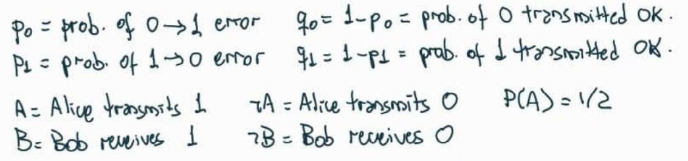
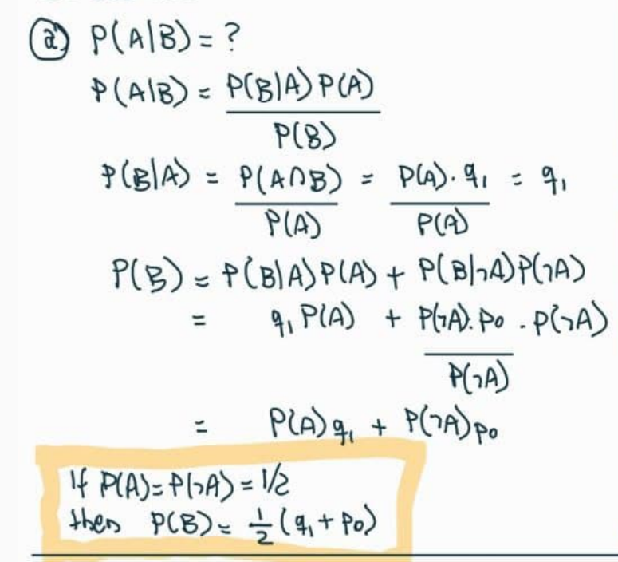
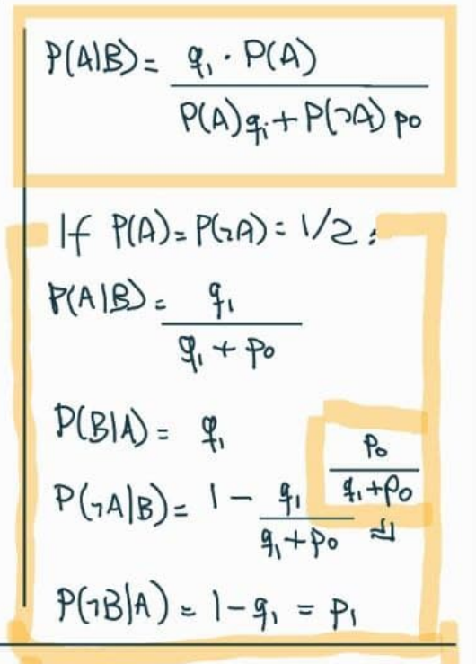
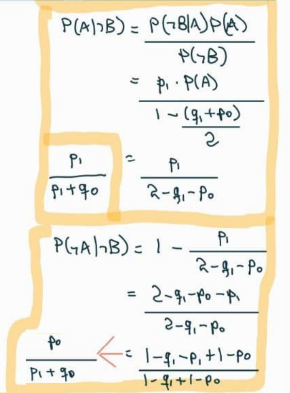

# 04: Probabilidade condicional {-}

## Vídeo {-}

```{r echo=FALSE, results='asis', out.extra=center()}
embed_yt('P7NE4WF8j-Q')
```


## Exercícios do livro (cap. 2) {-}

### 2 {-}

::: {.rmdbox latex=1}

* Uma mulher está grávida de meninos gêmeos.

* Gêmeos podem ser idênticos ou fraternos.

* $1/3$ dos gêmeos são idênticos.

* Gêmeos idênticos têm $50\%$ de chance de serem ambos meninos, e $50\%$ de chance de serem ambos meninas.

* Para gêmeos fraternos, cada gêmeo tem, independentemente, $50\%$ de chance de ser menino, e $50\%$ de chance de ser menina.

* Qual a probabilidade de a mulher estar grávida de gêmeos idênticos?

:::

* Eventos:

  $$
  \begin{aligned}
  I &= \text{os gêmeos são idênticos} \\
  M &= \text{os gêmeos são dois meninos}
  \end{aligned}
  $$

* Probabilidades dadas:

  $$
  \begin{aligned}
  P(I) &= 1/3 \\
  P(M \mid I) &= 1/2 \\
  P(M \mid \neg I) &= 1/4
  \end{aligned}
  $$

* Queremos calcular $P(I \mid M)$. Usamos Bayes:

  $$
  \begin{aligned}
  P(I \mid M) 
  &=
  \frac{P(M \mid I) \cdot P(I)}{P(M)}
  \end{aligned}
  $$

* Só falta o valor de $P(M)$, que calculamos usando probabilidade total:

  $$
  \begin{aligned}
  P(M) 
  &=
  P(M \mid I)P(I) + P(M \mid \neg I)P(\neg I) \\
  &=
  1/2 \cdot 1/3 + 1/4 \cdot 2/3 \\
  &=
  1/3
  \end{aligned}
  $$

* Concluímos

  $$
  \begin{aligned}
  P(I \mid M) 
  &=
  \frac{P(M \mid I) \cdot P(I)}{P(M)} \\
  &=
  \frac{1/2 \cdot 1/3}{1/3} \\
  &=
  1/2
  \end{aligned}
  $$


### 4 {-}

::: {.rmdbox latex=1}

* Um aluno está resolvendo uma questão de múltipla escolha com $n$ opções.

* $K$ é o evento que corresponde a ele saber a resposta correta.

* $R$ é o evento que corresponde a ele acertar (sabendo ou chutando).

* Se ele sabe a resposta, ele acerta.

* Se ele não sabe, ele chuta uma opção ao acaso.

* Considere $P(K) = p$.

(a) Ache $P(K \mid R)$.

(b) Mostre que $P(K \mid R) \geq p$. Por que isto faz sentido? Quando a igualdade é exata?

:::

a. Vamos usar Bayes, supondo $p = P(K) > 0$:

   $$
   \begin{aligned}
   P(K \mid R)
   &=
   \frac{P(R \mid K) \cdot P(K)}{P(R)} \\
   &=
   \frac{1 \cdot p}{
     P(R \mid K) \cdot P(K) + 
     P(R \mid \neg K) \cdot P(\neg K)
   } \\
   &=
   \frac{p}{
     1 \cdot p + 
     \frac{1}{n} \cdot (1 - p)
   } \\
   &=
   \frac{np}{np + (1 - p)}
   \end{aligned}
   $$

b. Isto equivale a mostrar

   $$
   \frac{np}{np + (1 - p)} \geq p
   $$

   Como todos os valores são positivos, isto equivale a 
   
   $$
   np \geq np^2 + (1 - p)p
   $$

   Dividindo ambos os lados por $p > 0$:
   
   $$
   n \geq np + 1 - p
   $$
   
   Daí,
   
   $$
   \begin{aligned}
   n \geq np + 1 - p 
   &\iff n - np \geq 1 - p \\
   &\iff n(1 - p) \geq 1 - p \\
   &\iff n \geq 1 & \text{(supondo } p < 1 \text{)}
   \end{aligned}
   $$
   O que é verdade, pois existe pelo menos uma opção (a correta).
   
   Se $p = 1$, a igualdade vale, e $P(K \mid R) = 1$, pois o aluno sempre sabe a resposta e sempre acerta.
   
   Se $n = 1$, a igualdade vale, e $P(K \mid R) = p$, pois o aluno acertar (ele sempre acerta!) e o aluno saber são independentes.
   
   Imagine $n > 1$. 
   
   Lembre-se de que $P(K \mid R) = \frac{P(K \cap R)}{P(R)}$.
   
   O numerador é a probabilidade do evento "o aluno sabe e o aluno acerta". Esta probabilidade é exatamente $p$, pois "o aluno sabe" é sub-evento de "o aluno acerta".
   
   O numerador $P(R)$ é um número tal que $0 < P(R) < 1$. Vamos chamar este número de $1/x$, para $x > 1$.
   
   Então, 
   
   $$
   P(K \mid R) = \frac{P(K \cap R)}{P(R)} = \frac{p}{1/x} = xp > p
   $$
   
#### Em R {-}

Valores teóricos:

```{r}
n <- 1:9
p <- seq(0, 1, .25)

df <- expand.grid(n = n, p = p) %>% 
  mutate(
    pkr_teorico = n * p / (p * (n - 1) + 1)
  ) %>% 
  arrange(n)

df
```

Gráfico:

```{r echo=FALSE}
df %>% 
  ggplot(aes(p, pkr_teorico)) +
    geom_line(
      aes(group = n, color = fct_rev(as.factor(n))),
      size = 1.25
    ) +
    labs(
      x = 'P(K)',
      y = 'P(K|R)',
      color = 'n'
    )
```

::: {.rmdnote latex=1}

Conclusão óbvia: quanto maior o número $n$ de opções, maior a probabilidade $P(K \mid R)$ de o aluno ter acertado sabendo, em oposição a ter acertado chutando:

$$
\begin{aligned}
\lim_{n \to \infty} P(K \mid R) 
&=
\lim_{n \to \infty} \frac{np}{np + 1 - p} \\
&=
\lim_{n \to \infty} \frac{p}{p} \\
&= 1
\end{aligned}
$$

:::

Simulação:

```{r}
sim <- function(n, p, reps = 1e7) {
  
  sabe <- sample(
    c(TRUE, FALSE), 
    reps,
    replace = TRUE,
    c(p, 1 - p)
  )

  acerta <- sabe
  nao_sabe <- sum(!sabe)
  
  acerta[which(!sabe)] <- 
    sample(
      c(TRUE, FALSE),
      nao_sabe,
      replace = TRUE,
      prob = c(1/n, 1 - 1/n)
    )
  
  sum(sabe) / sum(acerta)
  
}

sim <- Vectorize(sim)
```

```{r cache=TRUE}
df <- df %>% 
  mutate(
    pkr_simulado = sim(n, p)
  )

df
```

```{r echo=FALSE}
df %>% 
  pivot_longer(
    cols = starts_with('pkr'),
    names_to = 'tipo',
    names_prefix = 'pkr_',
    values_to = 'valor'
  ) %>% 
  ggplot(aes(p, valor)) +
    geom_line(
      aes(group = n, color = fct_rev(as.factor(n))),
      size = 1.25
    ) +
    labs(
      x = 'P(K)',
      y = 'P(K|R)',
      color = 'n'
    ) +
    facet_wrap(~fct_rev(tipo)) +
    theme(panel.spacing.x = unit(.5, 'cm'))
```


### 12 {-}

::: {.rmdbox latex=1}

a. Alice está tentando enviar uma mensagem codificada em binário para Bob.

   * Ela envia um *bit*: $0$ ou $1$ com probabilidades iguais. 
   
   * Se ela envia $0$, há probabilidade $5\%$ de erro. 
   
   * Se ela envia $1$, há probabilidade $10\%$ de erro.

   * Dado que Bob recebeu $1$, qual a probabilidade de Alice ter enviado $1$?

:::

* Eventos e probabilidades:

    ```{r echo=FALSE}
    
    ```
  

* Queremos achar $P(A \mid B)$. Usando Bayes:

    ```{r echo=FALSE, out.width='75%'}
    
    ```

    ```{r}
    p0 <- .05
    p1 <- .1
    q0 <- 1 - p0
    q1 <- 1 - p1
    
    pA <- 1/2
    pBIA <- q1
    pB <- (q1 + p0) / 2
    pAIB <- pBIA * pA / pB
    
    pAIB
    ```

* Para sermos completos, vamos calcular outras probabilidades, com $P(A) = P(\neg A) = 1/2$:

    ```{r echo=FALSE, out.width='50%'}
    
    ```
    
    ```{r echo=FALSE, out.width='50%'}
    
    ```

* Simulação:

    ```{r sim1, cache=TRUE}
    reps <- 1e7
    alice_envia <- sample(c(0, 1), reps, replace = TRUE)
    bob_recebe <- alice_envia
    
    bob_recebe[which(alice_envia == 0)] <- 
      sample(
        c(0, 1), 
        length(which(alice_envia == 0)),
        replace = TRUE,
        prob = c(95/100, 5/100)
      )
    
    bob_recebe[which(alice_envia == 1)] <- 
      sample(
        c(0, 1), 
        length(which(alice_envia == 1)),
        replace = TRUE,
        # Atenção: aqui, erro é 1 virar 0:
        prob = c(10/100, 90/100)  
      )
    
    pab <- sum(alice_envia & bob_recebe) / sum(bob_recebe)
    pab
    ```

::: {.rmdbox latex=1}

b. Agora, eles usam um [código com repetição]{.hl}:

   * Alice envia $000$ para representar $0$ e $111$ para representar $1$.
   
   * Bob decodifica a mensagem tomando o *bit* que está em maioria.
   
   * As probabilidades de erro são como antes, e os erros em *bits* diferentes são independentes.
   
   * Dado que Bob recebe $110$, qual a probabilidade de que Alice tenha enviado $111$?

:::

* Eventos:

  $$
  \begin{aligned}
  AAA &= \text{Alice envia } 111 \\
  BB\neg B &= \text{Bob recebe } 110
  \end{aligned}
  $$

* $P(AAA) = 1/2$, pois Alice envia somente $111$ ou $000$.

* Usando Bayes:

  $$
  P(AAA \mid BB\neg B) = 
  \frac{P(BB\neg B \mid AAA) \cdot P(AAA)}{P(BB\neg B)}
  $$

* $P(BB\neg B \mid AAA) = q_1 \cdot q_1 \cdot p_1$, pois erros em *bits* diferentes são independentes.

* Pela lei da probabilidade total:

  $$
  \begin{aligned}
  P(BB\neg B) 
  &= P(BB\neg B \mid AAA) \cdot P(AAA) + 
     P(BB\neg B \mid \neg(AAA))P(\neg(AAA)) \\
  &= \frac12 \cdot \left( q_1 \cdot q_1 \cdot p_1 +
     p_0 \cdot p_0 \cdot q-0 \right)
  \end{aligned}
  $$

* Daí,

  $$
  \begin{aligned}
  P(AAA \mid BB\neg B) 
  &= 
  \frac{P(BB\neg B \mid AAA) \cdot P(AAA)}{P(BB\neg B)} \\
  &= 
  \frac{
    q_1 \cdot q_1 \cdot p_1 \cdot 1/2
  }{
    \left( q_1 \cdot q_1 \cdot p_1 +
     p_0 \cdot p_0 \cdot q_0 \right)\cdot 1/2
  } \\
  &= 
  \frac{
    q_1 \cdot q_1 \cdot p_1
  }{
    \left( q_1 \cdot q_1 \cdot p_1 +
     p_0 \cdot p_0 \cdot q_0 \right)
  }
  \end{aligned}
  $$

* Numericamente:

    ```{r}
    q1 * q1 * p1 / (q1 * q1 * p1 + p0 * p0 * q0)
    ```


### 14 {-}

::: {.rmdbox latex=1}

Se $P(A), P(B) \in (0, 1)$, então

$$
P(A \mid B) > P(A \mid \neg B) \iff
P(B \mid A) > P(B \mid \neg A)
$$

:::

???


### 15 {-}

::: {.rmdbox latex=1}

$A$ e $B$ são eventos com

$$
0 < P(A \cap B) < P(A) < P(B) < P(A \cup B) < 1
$$

Você está torcendo para que $A$ e $B$ [ambos]{.hl} ocorram.

O que você ficaria mais feliz em observar?

* Que $A$ ocorreu?

* Que $B$ ocorreu?

* Que $A \cup B$ ocorreu?

:::

* Queremos observar o evento $E$ tal que $P(A \cap B \mid E)$ seja máximo.

  $$
  \begin{aligned}
  P(A \cap B \mid A) &= \frac{P(A \cap B)}{P(A)} \\
  P(A \cap B \mid B) &= \frac{P(A \cap B)}{P(B)} \\
  P(A \cap B \mid A \cup B) &= 
    \frac{P((A \cap B) \cap (A \cup B))}{P(A \cup B)} \\
    &= \frac{P(A \cap B)}{P(A \cup B)}
  \end{aligned}
  $$

* Como $P(A)$ é o menor denominador, observar $A$ maximiza $P(A \cap B \mid E)$.

* Intuitivamente, como $A$ é o evento menos provável dos dois, saber que $A$ ocorreu nos deixa mais próximo da ocorrência dos dois eventos do que saber que $B$ (ou que algum dos dois) ocorreu.


### 16 {-}

::: {.rmdbox latex=1}

$$
P(A \mid B) \leq P(A) \implies P(A \mid \neg B) \geq P(A)
$$

:::

* Se a ocorrência de $B$ torna $A$ menos provável, então a não-ocorrência de $B$ torna $A$ mais provável.

* Pela lei da probabilidade total:

  $$
  \begin{aligned}
  P(A) &= P(A \mid B)P(B) + P(A \mid \neg B)P(\neg B) \\
  \therefore P(A \mid \neg B) &= 
    \frac{P(A) - P(A \mid B)P(B)}{P(\neg B)}
  \end{aligned}
  $$

* Daí,

  $$
  \begin{aligned}
  P(A \mid \neg B) 
  &\geq
    \frac{P(A) - P(A)P(B)}{P(\neg B)} & \text{pois } P(A \mid B) \leq P(A) \\
  &= \frac{P(A)(1 - P(B))}{P(\neg B)} \\
  &= P(A)
  \end{aligned}
  $$


### 17 {-}

::: {.rmdbox latex=1}

Em lógica determinística, $A \to B \iff \neg B \to \neg A$.

Em probabilidades?

Considere eventos $A$ e $B$ com $P(A), P(B) \not\in \{0, 1\}$.

a. Mostre que $P(B \mid A) = 1 \implies P(\neg A \mid \neg B) = 1$.

:::

* $A$ está contido em $B$:

  $$
  P(B \mid A) = 1 
  \iff \frac{P(A \cap B)}{P(A)} = 1
  \iff P(A \cap B) = P(A)
  $$

* Vamos mostrar que $P(\neg A \mid \neg B) = 1$:

  $$
  \begin{aligned}
  P(\neg A \mid \neg B) 
  &= \frac{P(\neg A \cap \neg B)}{P(\neg B)} \\
  &= \frac{P(\neg (A \cup B))}{P(\neg B)} \\
  &= \frac{1 - P(A \cup B)}{P(\neg B)} \\
  &= \frac{1 - \left[ P(A) + P(B) - P(A \cap B) \right]}{P(\neg B)} \\
  &= \frac{1 - P(B)}{P(\neg B)} \\
  &= \frac{P(\neg B)}{P(\neg B)} \\
  &= 1
  \end{aligned}
  $$

::: {.rmdbox latex=1}

b. Mostre que, se "$=$" for substituído por "$\approx$", o resultado não vale. Ache um exemplo em que $P(B \mid A)$ seja quase $1$, mas $P(\neg A \mid \neg B)$ seja quase $0$.

:::

* Valores de exemplo, com $A$ e $B$ independentes:

  $$
  \begin{aligned}
  P(A) &= 80/100 \\
  P(B) &= 90/100 \\
  P(\neg A) &= 20/100 \\
  P(\neg B) &= 10/100 \\
  P(A \cap B) &= P(A) \cdot P(B) = 72/100 \\
  P(A \cup B) &= P(A) + P(B) - P(A \cap B) = 98/100\\
  P(B \mid A) &= \frac{P(A \cap B)}{P(A)} = 72/80 \approx 1 \\
  P(\neg A \mid \neg B) &= \frac{P(\neg A \cap \neg B)}{P(\neg B)} = 
    \frac{1 - P(A \cup B)}{P(\neg B)} = 2/10 \approx 0
  \end{aligned}
  $$

::: {.rmdnote latex=1}

Vamos criar uma medida de independência. Se $P(A) \neq 0$  e $P(B) \neq 0$, definimos

$$
I = \frac{P(A \cap B)}{P(A)P(B)}
$$

Com isso,

* $A$ e $B$ são disjuntos ${} \iff I = 0$ 

* $A$ e $B$ são independentes ${} \iff I = 1$ 

* $A$ e $B$ se atrapalham ${} \iff 0 < I < 1$. 

  I.e., $P(A) > P(A \mid B)$ e $P(B) > P(B \mid A)$.

* $A$ e $B$ se ajudam ${} \iff I > 1$. 

  I.e., $P(A) < P(A \mid B)$ e $P(B) < P(B \mid A)$.

:::


```{r echo=FALSE, cache=TRUE}
pa <- seq(0, .99, .01)[-1]
pb <- seq(0, .99, .01)[-1]
pab <- seq(0, .99, .01)[-1]

df <- expand_grid(pa, pb, pab) %>% 
  filter(pab <= pa, pab <= pb) %>% 
  mutate(
    I = pab / (pa * pb),
    pbIa = (pab / pa),
    pnaInb = (1 - pa - pb + pab) / (1 - pb)
  ) %>% 
  filter(pnaInb >= 0)
```

```{r echo=FALSE, cache=TRUE}
df %>%  
  arrange(I) %>% 
  ggplot() +
    geom_line(aes(1:nrow(df), I)) +
    scale_x_continuous(breaks = NULL) +
    labs(
      x = '',
      y = '',
      title = TeX(
        'Valores de $I$ para $P(A), P(B), P(A, B) \\in \\{.01,\\ldots, .99\\}$'
      ),
      subtitle = '(grid 100 x 100)'
    )
  
```

```{r echo=FALSE, cache=TRUE}
corte <- .8

df1 <- df %>% 
  filter(
    pbIa > corte,
    pnaInb < 1 - corte
  )

df1 %>% 
  arrange(I) %>% 
  ggplot() +
    geom_line(aes(1:nrow(df1), I, color = '1. I')) +
    geom_line(aes(1:nrow(df1), pbIa, color = '2. P(B | A)')) +
    geom_line(aes(1:nrow(df1), pnaInb, color = '3. P(~A | ~B)')) +
    scale_x_continuous(breaks = NULL) +
    labs(
      x = '',
      y = '',
      color = '',
      subtitle = TeX(
        paste(
          '$P(B|A)$ acima de', corte,
          'e $P(\\neg A | \\neg B)$ abaixo de', 1 - corte
        )
      ),
      title = TeX(
        paste(
          '$(P(B | A) \\approx 1 \\vee P(\\neg A | \\neg B) \\approx 0) ',
          '{}\\to I \\approx 1$'
        )
      )
    )
```


### 22 {-}

::: {.rmdbox latex=1}

Este problema foi proposto pela primeira vez por Lewis Carroll em 1893.

* Uma bolsa contém uma bola, que é ou azul, ou verde, com probabilidades iguais. 

* Uma bola verde é colocada na bolsa; agora, há $2$ bolas na bolsa.

* Uma bola é retirada da bolsa ao acaso.

* A bola retirada é verde.

* Qual é a probabilidade de que a bola que sobrou na bolsa seja verde?

:::

* Antes de mais nada, vamos definir os eventos:

  $$
  \begin{aligned}
    O &= \text{bola original é verde} \\
    R &= \text{bola retirada é verde} \\
    S &= \text{bola que sobrou é verde}
  \end{aligned}
  $$

* O importante é perceber que o enunciado diz que o evento $R$ aconteceu, mas as probabilidades devem ser calculadas pensando em todos os resultados possíveis, [antes de o experimento acontecer.]{.hl}

* Ou seja, em vez de tomar $P(R) = 1$ --- [o que seria errado]{.hl} --- vamos calcular $P(S \mid R)$: a probabilidade de que a bola que sobrou seja verde, [sabendo que a bola retirada foi verde.]{.hl}

* Começamos com a lei da probabilidade total, condicionando aos dois casos possíveis:

  $$
  \begin{aligned}
  P(S \mid R) &= 
  \underbrace{P(S \mid R, O) \cdot P(O \mid R)}_{\text{caso 1: bola original verde}} 
  \;+\;
  \underbrace{P(S \mid R, \neg O) \cdot P(\neg O \mid R)}_{\text{caso 2: bola original azul}}  
  \end{aligned}
  $$

* No caso $1$:

  $$
  \begin{aligned}
  P(S \mid R, O) \cdot P(O \mid R) 
  &= 1 \cdot P(O \mid R) \\
  &= P(O \mid R)
  \end{aligned}
  $$

* No caso $2$:

  $$
  \begin{aligned}
  P(S \mid R, \neg O) \cdot P(\neg O \mid R) 
  &= 0 \cdot P(\neg O \mid R) \\
  &= 0
  \end{aligned} 
  $$

  Isto faz sentido: [se a bola original era azul, não há como a bola que sobrou ser verde.]{.hl}
  
* Só precisamos calcular a probabilidade do caso $1$, que é $P(O \mid R)$. Vamos usar Bayes:

  $$
  \begin{aligned}
  P(O \mid R) 
  &= \frac{P(R \mid O) \cdot P(O)}{P(R)} \\
  &= \frac{1 \cdot 1/2}{P(R)}
  \end{aligned}
  $$

* Para calcular $P(R)$, lei da probabilidade total de novo, condicionando sobre a bola original:

  $$
  \begin{aligned}
  P(R) 
  &= P(R \mid O) \cdot P(O) + P(R \mid \neg O) \cdot P(\neg O) \\
  &= 1 \cdot 1/2 + 1/2 \cdot 1/2 \\
  &= 3/4
  \end{aligned}
  $$

* Chegamos a

  $$
  \begin{aligned}
  P(O \mid R) 
  &= \frac{P(R \mid O) \cdot P(O)}{P(R)} \\
  &= \frac{1 \cdot 1/2}{P(R)} \\
  &= \frac{1/2}{3/4} \\
  &= \frac{2}{3}
  \end{aligned}
  $$

* Outra maneira de calcular $P(S \mid R)$ seria aplicar Bayes primeiro:

  $$
  P(S \mid R) = \frac{P(R \mid S) \cdot P(S)}{P(R)}
  $$

  mas as probabilidades do numerador são mais difíceis de calcular! Teríamos que usar a lei da probabilidade total duas vezes para o numerador (além de uma vez para o denominador).


### 29 {-}

::: {.rmdbox latex=1}

Uma família tem $2$ crias.

Cada cria tem a mesma probabilidade de ser menino ou menina, e os sexos delas são independentes.

Cada cria tem a característica $C$ com probabilidade $p$, independentemente uma da outra e do sexo.

Mostre que a probabilidade de serem [duas meninas]{.hl}, dado que [pelo menos uma das crias é uma menina com a característica $C$]{.hl}, é

$$
\frac{2 - p}{4 - p}
$$

Observe:

* Se $p = 1$, então a probabilidade é $1/3$, como no exemplo 2.2.5.

* Se $p \to 0$, então a probabilidade tende a $1/2$ pela esquerda, como no exemplo 2.2.7.

:::

* Eventos:

  $$
  \begin{aligned}
  AA &= \text{As duas são meninas} \\
  AC &= \text{Pelo menos uma é menina e tem } C
  \end{aligned}
  $$

* Vamos usar Bayes:

  $$
  P(AA \mid AC) = \frac{P(AC \mid AA) \cdot P(AA)}{P(AC)}
  $$

* A probabilidade de ambas serem meninas é 

  $$
  P(AA) = 1/4
  $$

* A probabilidade $P(AC)$ de pelo menos uma ser menina e ter $C$ é a soma das probabilidades de

  * Ambas serem meninas, ambas terem $C$: $\frac14 \cdot p^2$.
  
  * Ambas serem meninas, só uma ter $C$ (a primeira ou a segunda): $2 \cdot   \frac14 \cdot p \cdot (1 - p)$.
  
  * Uma ser menina com $C$, a outra ser menino (com ou sem $C$): $\frac12 \cdot p$.

  * Logo, 
    $$
    P(AC) = \frac{p \cdot (4 - p)}{4}
    $$

* A probabilidade $P(AC \mid AA)$ de uma ser menina com $C$, dado que ambas são meninas, é

  $$
  \begin{aligned}
  P(AC \mid AA) &= 1 - (1 - p)^2 \\
  &= p \cdot (2 - p)
  \end{aligned}
  $$

* Juntando tudo:

  $$
  \begin{aligned}
  P(AA \mid AC) 
  &= \frac{P(AC \mid AA) P(AA)}{P(AC)} \\
  &= \frac
    {p \cdot (2 - p) \cdot 1/4}
    {p \cdot (4 - p) \cdot 1/4} \\
  &= \frac{2 - p}{4 - p}
  \end{aligned}
  $$

* Um gráfico:

    ```{r echo=FALSE}
    ggplot() +
      stat_function(
        fun = ~ (2 - .x) / (4 - .x),
        xlim = c(0, 1)
      ) +
      scale_y_continuous(
        limits = c(0, .6),
        breaks = c(seq(0, 1, .25), 1/3) %>% round(2),
      ) +
      labs(
        title = TeX(
          'Valor de $\\frac{2 - p}{4 - p}$ em função de $p$'
        ),
        y = '',
        x = 'p'
      )
    ```

