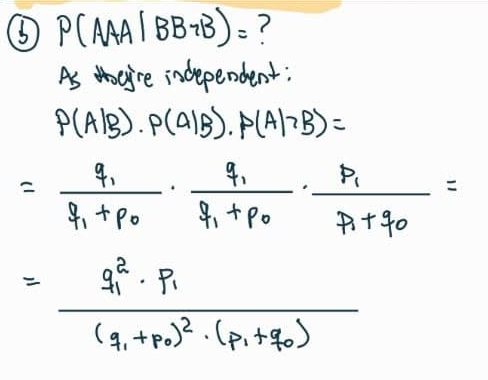
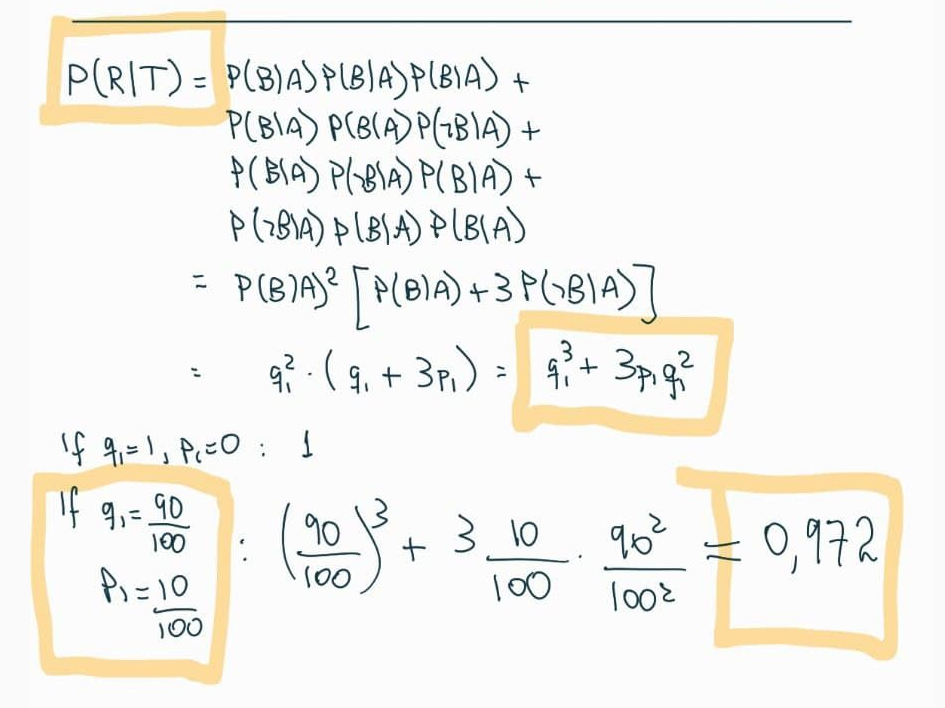

# 04: Probabilidade condicional {-}

## Vídeo {-}

```{r echo=FALSE, results='asis', out.extra=center()}
embed_yt('P7NE4WF8j-Q')
```


## Exercícios {-}

[Enunciados (pdf).](https://projects.iq.harvard.edu/files/stat110/files/strategic_practice_and_homework_2.pdf)


### Homework {-}

#### 3.1 Lewis Carroll {-}

::: {.rmdbox latex=1}

Este problema foi proposto pela primeira vez por Lewis Carroll em 1893.

* Uma bolsa contém uma bola, que é ou azul, ou verde, com probabilidades iguais. 

* Uma bola verde é colocada na bolsa; agora, há $2$ bolas na bolsa.

* Uma bola é retirada da bolsa ao acaso.

* A bola retirada é verde.

* Qual é a probabilidade de que a bola que sobrou na bolsa seja verde?

:::

* Antes de mais nada, vamos definir os eventos:

  $$
  \begin{aligned}
    O &= \text{bola original é verde} \\
    R &= \text{bola retirada é verde} \\
    S &= \text{bola que sobrou é verde}
  \end{aligned}
  $$

* O importante é perceber que o enunciado diz que o evento $R$ aconteceu, mas as probabilidades devem ser calculadas pensando em todos os resultados possíveis, [antes de o experimento acontecer.]{.hl}

* Ou seja, em vez de tomar $P(R) = 1$ --- [o que seria errado]{.hl} --- vamos calcular $P(S \mid R)$: a probabilidade de que a bola que sobrou seja verde, [sabendo que a bola retirada foi verde.]{.hl}

* Começamos com a lei da probabilidade total, condicionando aos dois casos possíveis:

  $$
  \begin{aligned}
  P(S \mid R) &= 
  \underbrace{P(S \mid R, O) \cdot P(O \mid R)}_{\text{caso 1: bola original verde}} 
  \;+\;
  \underbrace{P(S \mid R, \neg O) \cdot P(\neg O \mid R)}_{\text{caso 2: bola original azul}}  
  \end{aligned}
  $$

* No caso $1$:

  $$
  \begin{aligned}
  P(S \mid R, O) \cdot P(O \mid R) 
  &= 1 \cdot P(O \mid R) \\
  &= P(O \mid R)
  \end{aligned}
  $$

* No caso $2$:

  $$
  \begin{aligned}
  P(S \mid R, \neg O) \cdot P(\neg O \mid R) 
  &= 0 \cdot P(\neg O \mid R) \\
  &= 0
  \end{aligned} 
  $$

  Isto faz sentido: [se a bola original era azul, não há como a bola que sobrou ser verde.]{.hl}
  
* Só precisamos calcular a probabilidade do caso $1$, que é $P(O \mid R)$. Vamos usar Bayes:

  $$
  \begin{aligned}
  P(O \mid R) 
  &= \frac{P(R \mid O) \cdot P(O)}{P(R)} \\
  &= \frac{1 \cdot 1/2}{P(R)}
  \end{aligned}
  $$

* Para calcular $P(R)$, lei da probabilidade total de novo, condicionando sobre a bola original:

  $$
  \begin{aligned}
  P(R) 
  &= P(R \mid O) \cdot P(O) + P(R \mid \neg O) \cdot P(\neg O) \\
  &= 1 \cdot 1/2 + 1/2 \cdot 1/2 \\
  &= 3/4
  \end{aligned}
  $$

* Chegamos a

  $$
  \begin{aligned}
  P(O \mid R) 
  &= \frac{P(R \mid O) \cdot P(O)}{P(R)} \\
  &= \frac{1 \cdot 1/2}{P(R)} \\
  &= \frac{1/2}{3/4} \\
  &= \frac{2}{3}
  \end{aligned}
  $$

* Outra maneira de calcular $P(S \mid R)$ seria aplicar Bayes primeiro:

  $$
  P(S \mid R) = \frac{P(R \mid S) \cdot P(S)}{P(R)}
  $$

  mas as probabilidades do numerador são mais difíceis de calcular! Teríamos que usar a lei da probabilidade total duas vezes para o numerador (além de uma vez para o denominador).


#### 3.5 Xadrez {-}

::: {.rmdbox latex=1}

* Você vai jogar $2$ partidas de xadrez contra um adversário desconhecido. 

* O nível do seu adversário pode ser novato, intermediário, ou avançado, com probabilidades iguais.

* As probabilidades de você vencer uma partida são, dependendo do nível do adversário, respectivamente, $90\%$, $50\%$, e $30\%$.

a. Qual a probabilidade de você vencer a primeira partida?

b. Parabéns, você venceu a primeira partida. Dada esta informação, qual a probabilidade de que você também vença a segunda partida (suponha que, [dado o nível do seu adversário]{.hl}, os resultados das partidas são independentes)?

c. Explique a diferença entre 

   1. supor que os resultados das partidas são independentes, e
   
   2. supor que os resultados das partidas são independentes, dado o nível do seu adversário.
   
   Qual destas suposições parece mais razoável? Por quê?

:::

* Antes de mais nada, vamos definir os eventos:

  $$
  \begin{aligned}
    N &= \text{o adversário é novato} \\
    I &= \text{o adversário é intermediário} \\
    A &= \text{o adversário é avançado} \\
    V_1 &= \text{você vence a primeira partida} \\
    V_2 &= \text{você vence a segunda partida} 
  \end{aligned}
  $$

* O enunciado dá as probabilidades

  $$
  \begin{aligned}
  P(N) &= 1/3 \\
  P(I) &= 1/3 \\
  P(A) &= 1/3 \\
  P(V_1 \mid N) &= 9/10 \\
  P(V_1 \mid I) &= 5/10 \\
  P(V_1 \mid A) &= 3/10
  \end{aligned}
  $$

* Para resolver (a), basta usar probabilidade total, condicionando sobre o nível do adversário:

  $$
  \begin{aligned}
  P(V_1) 
  &= 
  P(V_1 \mid N) \cdot P(N) \;+\;
  P(V_1 \mid I) \cdot P(I) \;+\;
  P(V_1 \mid A) \cdot P(A)
  \\
  &= 
  \frac{9}{10} \cdot \frac{1}{3} + 
  \frac{5}{10} \cdot \frac{1}{3} + 
  \frac{3}{10} \cdot \frac{1}{3} \\
  &= 
  \frac{1}{3} \cdot \left(
  \frac{9}{10} + 
  \frac{5}{10} + 
  \frac{3}{10} \right) \\
  &=
  \frac{17}{30}
  \end{aligned}
  $$

  Faz sentido. Como as probabilidades dos níveis possíveis do adversário são iguais, a probabilidade de vencer é [a média aritmética]{.hl} das probabilidades de vencer contra cada nível.
  
  Se as probabilidades dos níveis do adversário fossem diferentes, seria a [média ponderada.]{.hl}
  
* Para (b), queremos calcular $P(V_2 \mid V_1)$.

  Dizer que $V_1$ e $V_2$ são independentes [dado o nível do adversário]{.hl} é dizer
  
  $$
  P(V_2 \mid V_1, N) = P(V_1 \mid V_2, N) = P(V_2 \mid N) = P(V_1 \mid N)
  $$

  e analogamente para probabilidades condicionadas a $I$ e a $A$.
  
  Ou seja, dado um nível específico do adversário, saber que $V_1$ ocorreu não altera a probabilidade de $V_2$ ocorrer, e vice-versa.
  
  Vamos calcular $P(V_2 \mid V_1)$ usando probabilidade total, condicionando ao nível:
  
  $$
  \begin{aligned}
  \underbrace{P(V_2 \mid V_1, N) \cdot P(N \mid V_1)}_{\text{novato}}
  \;+\;
  \underbrace{P(V_2 \mid V_1, I) \cdot P(I \mid V_1)}_{\text{intermediário}}
  \;+\;
  \underbrace{P(V_2 \mid V_1, A) \cdot P(A \mid V_1)}_{\text{avançado}}
  \end{aligned}
  $$

  Para o lado esquerdo de cada produto, a independência condicional diz que
  
  \begin{alignat*}{3}
  P(V_2 \mid V_1, N) &= P(V_1 \mid N) &= 9/10 \\
  P(V_2 \mid V_1, I) &= P(V_1 \mid I) &= 5/10 \\
  P(V_2 \mid V_1, A) &= P(V_1 \mid A) &= 3/10
  \end{alignat*}

  Para o lado direito de cada produto, usamos Bayes. Todas as probabilidades envolvidas já foram calculadas.
  
  Novato:
  
  $$
  \begin{aligned}
  P(N \mid V_1) 
  &=
  \frac{P(V_1 \mid N) \cdot P(N)}{P(V_1)}
  \\
  &= \frac{9/10 \cdot 1/3}{17/30}
  \\
  &= \frac{9}{17}
  \end{aligned}
  $$

  Intermediário:
  
  $$
  \begin{aligned}
  P(I \mid V_1) 
  &=
  \frac{P(V_1 \mid I) \cdot P(I)}{P(V_1)}
  \\
  &= \frac{5/10 \cdot 1/3}{17/30}
  \\
  &= \frac{5}{17}
  \end{aligned}
  $$
  
  Avançado:
  
  $$
  \begin{aligned}
  P(A \mid V_1) 
  &=
  \frac{P(V_1 \mid A) \cdot P(A)}{P(V_1)}
  \\
  &= \frac{3/10 \cdot 1/3}{17/30}
  \\
  &= \frac{3}{17}
  \end{aligned}
  $$

  A resposta final é
  
  $$
  \frac{9}{10} \cdot \frac{9}{17} \;+\;
  \frac{5}{10} \cdot \frac{5}{17} \;+\;
  \frac{3}{10} \cdot \frac{3}{17}
  \;=\;
  \frac{`r (81 + 25 + 9)/5`}{`r 170/5`}
  $$

* Para responder (c):

  Dizer que $V_1$ e $V_2$ são [incondicionalmente]{.hl} independentes seria dizer que 
  
  $$
  P(V_2 \mid V_1) = P(V_2)
  $$

  Ainda mais, como o nível do adversário não muda de uma partida para outra, teríamos também 
  
  $$
  P(V_2) = P(V_1)
  $$

  Ou seja, cada partida seria uma prova de Bernoulli com a mesma probabilidade de sucesso.
  
  Considerando independência [condicional]{.hl}, saber que vencemos a primeira partida nos dá informação sobre o nível do adversário, e esta informação é considerada para calcular a probabilidade de vencer a segunda partida.
  
  De fato, usando independência condicional, temos
  
  $$
  P(V_1) \approx `r 17/30`
  $$
  
  e
  
  $$
  P(V_2 \mid V_1) \approx `r 23/34`
  $$
  

### Exercícios do livro (cap. 2) {-}

#### 2 {-}

::: {.rmdbox latex=1}

* Uma mulher está grávida de meninos gêmeos.

* Gêmeos podem ser idênticos ou fraternos.

* $1/3$ dos gêmeos são idênticos.

* Gêmeos idênticos têm $50\%$ de chance de serem ambos meninos, e $50\%$ de chance de serem ambos meninas.

* Para gêmeos fraternos, cada gêmeo tem, independentemente, $50\%$ de chance de ser menino, e $50\%$ de chance de ser menina.

* Qual a probabilidade de a mulher estar grávida de gêmeos idênticos?

:::

* Eventos:

  $$
  \begin{aligned}
  I &= \text{os gêmeos são idênticos} \\
  M &= \text{os gêmeos são dois meninos}
  \end{aligned}
  $$

* Probabilidades dadas:

  $$
  \begin{aligned}
  P(I) &= 1/3 \\
  P(M \mid I) &= 1/2 \\
  P(M \mid \neg I) &= 1/4
  \end{aligned}
  $$

* Queremos calcular $P(I \mid M)$. Usamos Bayes:

  $$
  \begin{aligned}
  P(I \mid M) 
  &=
  \frac{P(M \mid I) \cdot P(I)}{P(M)}
  \end{aligned}
  $$

* Só falta o valor de $P(M)$, que calculamos usando probabilidade total:

  $$
  \begin{aligned}
  P(M) 
  &=
  P(M \mid I)P(I) + P(M \mid \neg I)P(\neg I) \\
  &=
  1/2 \cdot 1/3 + 1/4 \cdot 2/3 \\
  &=
  1/3
  \end{aligned}
  $$

* Concluímos

  $$
  \begin{aligned}
  P(I \mid M) 
  &=
  \frac{P(M \mid I) \cdot P(I)}{P(M)} \\
  &=
  \frac{1/2 \cdot 1/3}{1/3} \\
  &=
  1/2
  \end{aligned}
  $$


#### 4 {-}

::: {.rmdbox latex=1}

* Um aluno está resolvendo uma questão de múltipla escolha com $n$ opções.

* $K$ é o evento que corresponde a ele saber a resposta correta.

* $R$ é o evento que corresponde a ele acertar (sabendo ou chutando).

* Se ele sabe a resposta, ele acerta.

* Se ele não sabe, ele chuta uma opção ao acaso.

* Considere $P(K) = p$.

(a) Ache $P(K \mid R)$.

(b) Mostre que $P(K \mid R) \geq p$. Por que isto faz sentido? Quando a igualdade é exata?

:::

a. Vamos usar Bayes, supondo $p = P(K) > 0$:

   $$
   \begin{aligned}
   P(K \mid R)
   &=
   \frac{P(R \mid K) \cdot P(K)}{P(R)} \\
   &=
   \frac{1 \cdot p}{
     P(R \mid K) \cdot P(K) + 
     P(R \mid \neg K) \cdot P(\neg K)
   } \\
   &=
   \frac{p}{
     1 \cdot p + 
     \frac{1}{n} \cdot (1 - p)
   } \\
   &=
   \frac{np}{np + (1 - p)}
   \end{aligned}
   $$

b. Isto equivale a mostrar

   $$
   \frac{np}{np + (1 - p)} \geq p
   $$

   Como todos os valores são positivos, isto equivale a 
   
   $$
   np \geq np^2 + (1 - p)p
   $$

   Dividindo ambos os lados por $p > 0$:
   
   $$
   n \geq np + 1 - p
   $$
   
   Daí,
   
   $$
   \begin{aligned}
   n \geq np + 1 - p 
   &\iff n - np \geq 1 - p \\
   &\iff n(1 - p) \geq 1 - p \\
   &\iff n \geq 1 & \text{(supondo } p < 1 \text{)}
   \end{aligned}
   $$
   O que é verdade, pois existe pelo menos uma opção (a correta).
   
   Se $p = 1$, a igualdade vale, e $P(K \mid R) = 1$, pois o aluno sempre sabe a resposta e sempre acerta.
   
   Se $n = 1$, a igualdade vale, e $P(K \mid R) = p$, pois o aluno acertar (ele sempre acerta!) e o aluno saber são independentes.
   
   Imagine $n > 1$. 
   
   Lembre-se de que $P(K \mid R) = \frac{P(K \cap R)}{P(R)}$.
   
   O numerador é a probabilidade do evento "o aluno sabe e o aluno acerta". Esta probabilidade é exatamente $p$, pois "o aluno sabe" é sub-evento de "o aluno acerta".
   
   O numerador $P(R)$ é um número tal que $0 < P(R) < 1$. Vamos chamar este número de $1/x$, para $x > 1$.
   
   Então, 
   
   $$
   P(K \mid R) = \frac{P(K \cap R)}{P(R)} = \frac{p}{1/x} = xp > p
   $$
   
##### Em R {-}

Valores teóricos:

```{r}
n <- 1:9
p <- seq(0, 1, .25)

df <- expand.grid(n = n, p = p) %>% 
  mutate(
    pkr_teorico = n * p / (p * (n - 1) + 1)
  ) %>% 
  arrange(n)

df
```

Gráfico:

```{r}
df %>% 
  ggplot(aes(p, pkr_teorico)) +
    geom_line(
      aes(group = n, color = fct_rev(as.factor(n))),
      size = 1.25
    ) +
    labs(
      x = 'P(K)',
      y = 'P(K|R)',
      color = 'n'
    )
```

::: {.rmdnote latex=1}

Conclusão óbvia: quanto maior o número $n$ de opções, maior a probabilidade $P(K \mid R)$ de o aluno ter acertado sabendo, em oposição a ter acertado chutando:

$$
\begin{aligned}
\lim_{n \to \infty} P(K \mid R) 
&=
\lim_{n \to \infty} \frac{np}{np + 1 - p} \\
&=
\lim_{n \to \infty} \frac{p}{p} \\
&= 1
\end{aligned}
$$

:::

Simulação:

```{r}
sim <- function(n, p, reps = 1e7) {
  
  sabe <- sample(
    c(TRUE, FALSE), 
    reps,
    replace = TRUE,
    c(p, 1 - p)
  )

  acerta <- sabe
  nao_sabe <- sum(!sabe)
  
  acerta[which(!sabe)] <- 
    sample(
      c(TRUE, FALSE),
      nao_sabe,
      replace = TRUE,
      prob = c(1/n, 1 - 1/n)
    )
  
  sum(sabe) / sum(acerta)
  
}

sim <- Vectorize(sim)
```

```{r cache=TRUE}
df <- df %>% 
  mutate(
    pkr_simulado = sim(n, p)
  )

df
```

```{r}
df %>% 
  pivot_longer(
    cols = starts_with('pkr'),
    names_to = 'tipo',
    names_prefix = 'pkr_',
    values_to = 'valor'
  ) %>% 
  ggplot(aes(p, valor)) +
    geom_line(
      aes(group = n, color = fct_rev(as.factor(n))),
      size = 1.25
    ) +
    labs(
      x = 'P(K)',
      y = 'P(K|R)',
      color = 'n'
    ) +
    facet_wrap(~fct_rev(tipo)) +
    theme(panel.spacing.x = unit(.5, 'cm'))
```


#### 12 {-}

::: {.rmdbox latex=1}

a. Alice está tentando enviar uma mensagem codificada em binário para Bob.

   * Ela envia um *bit*: $0$ ou $1$ com probabilidades iguais. 
   
   * Se ela envia $0$, há probabilidade $5\%$ de erro. 
   
   * Se ela envia $1$, há probabilidade $10\%$ de erro.

   * Dado que Bob recebeu $1$, qual a probabilidade de Alice ter enviado $1$?

:::

* Eventos e probabilidades:

    ```{r echo=FALSE}
    include_graphics('images/alice01.png')
    ```
  

* Queremos achar $P(A \mid B)$. Usando Bayes:

    ```{r echo=FALSE, out.width='75%'}
    include_graphics('images/alice02.png')
    ```

    ```{r}
    p0 <- .05
    p1 <- .1
    q0 <- 1 - p0
    q1 <- 1 - p1
    
    pA <- 1/2
    pBIA <- q1
    pB <- (q1 + p0) / 2
    pAIB <- pBIA * pA / pB
    
    pAIB
    ```

* Para sermos completos, vamos calcular outras probabilidades, com $P(A) = P(\neg A) = 1/2$:

    ```{r echo=FALSE, out.width='50%'}
    
    ```
    
    ```{r echo=FALSE, out.width='50%'}
    include_graphics('images/alice04.png')
    ```

* Simulação:

    ```{r sim1, cache=TRUE}
    reps <- 1e7
    alice_envia <- sample(c(0, 1), reps, replace = TRUE)
    bob_recebe <- alice_envia
    
    bob_recebe[which(alice_envia == 0)] <- 
      sample(
        c(0, 1), 
        length(which(alice_envia == 0)),
        replace = TRUE,
        prob = c(95/100, 5/100)
      )
    
    bob_recebe[which(alice_envia == 1)] <- 
      sample(
        c(0, 1), 
        length(which(alice_envia == 1)),
        replace = TRUE,
        # Atenção: aqui, erro é 1 virar 0:
        prob = c(10/100, 90/100)  
      )
    
    pab <- sum(alice_envia & bob_recebe) / sum(bob_recebe)
    pab
    ```

::: {.rmdbox latex=1}

b. Agora, eles usam um [código com repetição]{.hl}:

   * Alice envia $000$ para representar $0$ e $111$ para representar $1$.
   
   * Bob decodifica a mensagem tomando o *bit* que está em maioria.
   
   * As probabilidades de erro são como antes, e os erros em *bits* diferentes são independentes.
   
   * Dado que Bob recebe $110$, qual a probabilidade de que Alice tenha enviado $111$?

:::

* Teoricamente:

    ```{r echo=FALSE, out.width='50%'}
    
    ```

    ```{r}
    (q1^2 * p1) / ((q1 + p0)^2 * (p1 + q0))
    ```

* Simulação:

    ```{r sim2, cache=TRUE}
    reps <- 1e6
    
    alice_envia <- replicate(
      reps,
      sample(c(0, 1), 3, replace = TRUE),
      simplify = FALSE
    )
    
    bob_recebe <- alice_envia

    inserir_erros <- function(v) {
      
      original <- v
      
      v[which(original == 0)] <- 
        sample(
          c(0, 1), 
          length(which(original == 0)),
          replace = TRUE,
          prob = c(95/100, 5/100)
        )
      
      v[which(original == 1)] <- 
        sample(
          c(0, 1), 
          length(which(original == 1)),
          replace = TRUE,
          # Atenção: aqui, erro é 1 virar 0:
          prob = c(10/100, 90/100)  
        )

      v
      
    } 
    
    bob_recebe <- bob_recebe %>% 
      map(
        ~inserir_erros(.x)  
      )
    
    bob_recebe <- 
      bob_recebe %>% map_lgl(~ all(.x == c(1, 1, 0)))
    
    alice_envia <- 
      alice_envia %>% map_lgl(~ all(.x == c(1, 1, 1)))
    
    
    sum(alice_envia & bob_recebe) / sum(bob_recebe)
    ```

* A vantagem do esquema de repetição é que o envio de $111$ corresponde ao recebimento de $4$ cadeias diferentes: $111$, $011$, $101$, e $110$.

* Sem repetição, a probabilidade de Bob receber $1$ quando Alice transimiu $1$ é

  $$
  P(B \mid A) = q_1 = 0{,}9
  $$

* Com repetição, a probabilidade de Bob receber uma das $4$ cadeias que representam $1$ (evento $R$) quando Alice transmitiu $111$ (evento $T$) é

    ```{r echo=FALSE, out.width='75%'}
    
    ```


#### 14 {-}

Almost OK.


#### 15 {-}

OK.


#### 16 {-}

OK.


#### 17 {-}

::: {.rmdbox latex=1}

Em lógica determinística, $A \to B \iff \neg B \to \neg A$.

Em probabilidades?

Considere eventos $A$ e $B$ com $P(A), P(B) \not\in \{0, 1\}$.

a. Mostre que $P(B \mid A) = 1 \implies P(\neg A \mid \neg B) = 1$.

:::

* $A$ está contido em $B$:

  $$
  P(B \mid A) = 1 
  \iff \frac{P(A \cap B)}{P(A)} = 1
  \iff P(A \cap B) = P(A)
  $$

* Vamos mostrar que $P(\neg A \mid \neg B) = 1$:

  $$
  \begin{aligned}
  P(\neg A \mid \neg B) 
  &= \frac{P(\neg A \cap \neg B)}{P(\neg B)} \\
  &= \frac{P(\neg (A \cup B))}{P(\neg B)} \\
  &= \frac{1 - P(A \cup B)}{P(\neg B)} \\
  &= \frac{1 - \left[ P(A) + P(B) - P(A \cap B) \right]}{P(\neg B)} \\
  &= \frac{1 - P(B)}{P(\neg B)} \\
  &= \frac{P(\neg B)}{P(\neg B)} \\
  &= 1
  \end{aligned}
  $$

::: {.rmdbox latex=1}

b. Mostre que, se "$=$" for substituído por "$\approx$", o resultado não vale. Ache um exemplo em que $P(B \mid A)$ seja quase $1$, mas $P(\neg A \mid \neg B)$ seja quase $0$.

:::

Valores de exemplo, com $A$ e $B$ independentes:

$$
\begin{aligned}
P(A) &= 80/100 \\
P(B) &= 90/100 \\
P(\neg A) &= 20/100 \\
P(\neg B) &= 10/100 \\
P(A \cap B) &= P(A) \cdot P(B) = 72/100 \\
P(A \cup B) &= P(A) + P(B) - P(A \cap B) = 98/100\\
P(B \mid A) &= \frac{P(A \cap B)}{P(A)} = 72/80 \approx 1 \\
P(\neg A \mid \neg B) &= \frac{P(\neg A \cap \neg B)}{P(\neg B)} = 
  \frac{1 - P(A \cup B)}{P(\neg B)} = 2/10 \approx 0
\end{aligned}
$$

::: {.rmdnote latex=1}

Vamos criar uma medida de independência. Se $P(A) \neq 0$  e $P(B) \neq 0$, definimos

$$
I = \frac{P(A \cap B)}{P(A)P(B)}
$$

Com isso,

* $A$ e $B$ são disjuntos ${} \iff I = 0$ 

* $A$ e $B$ são independentes ${} \iff I = 1$ 

* $A$ e $B$ se atrapalham ${} \iff I < 1$. 

  I.e., $P(A) > P(A \mid B)$ e $P(B) > P(B \mid A)$.

* $A$ e $B$ se ajudam ${} \iff I > 1$. 

  I.e., $P(A) < P(A \mid B)$ e $P(B) < P(B \mid A)$.

:::


```{r echo=FALSE}
pa <- seq(0, .99, .01)[-1]
pb <- seq(0, .99, .01)[-1]
pab <- seq(0, .99, .01)[-1]

df <- expand_grid(pa, pb, pab) %>% 
  filter(pab <= pa, pab <= pb) %>% 
  mutate(
    I = pab / (pa * pb),
    pbIa = (pab / pa),
    pnaInb = (1 - pa - pb + pab) / (1 - pb)
  ) %>% 
  filter(pnaInb >= 0)
```

```{r echo=FALSE}
df %>%  
  arrange(I) %>% 
  ggplot() +
    geom_line(aes(1:nrow(df), I)) +
    scale_x_continuous(breaks = NULL) +
    labs(
      x = '',
      y = '',
      title = TeX(
        'Valores de $I$ para $P(A), P(B), P(A, B) \\in \\{.01,\\ldots, .99\\}$'
      )
    )
  
```

```{r echo=FALSE}
corte <- .8

df1 <- df %>% 
  filter(
    pbIa > corte,
    pnaInb < 1 - corte
  )

df1 %>% 
  arrange(I) %>% 
  ggplot() +
    geom_line(aes(1:nrow(df1), I, color = '1. I')) +
    geom_line(aes(1:nrow(df1), pbIa, color = '2. P(B | A)')) +
    geom_line(aes(1:nrow(df1), pnaInb, color = '3. P(~A | ~B)')) +
    scale_x_continuous(breaks = NULL) +
    labs(
      x = '',
      y = '',
      color = '',
      title = TeX(
        paste(
          '$(P(B | A) \\approx 1 \\vee P(\\neg A | \\neg B) \\approx 0) ',
          '{}\\to I \\approx 1$'
        )
      )
    )
```

```{r echo=FALSE}
corte <- .2

df1 <- df %>% 
  filter(
    between(I, 1 - corte, 1 + corte)
  )

df1 %>% 
  arrange(I) %>% 
  ggplot() +
    geom_line(aes(1:nrow(df1), I, color = '1. I')) +
    geom_line(aes(1:nrow(df1), pbIa, color = '2. P(B | A)'), alpha = .5) +
    geom_line(aes(1:nrow(df1), pnaInb, color = '3. P(~A | ~B)'), alpha = .5) +
    scale_x_continuous(breaks = NULL) +
    labs(
      x = '',
      y = '',
      color = '',
      title = TeX(
        paste(
          'Mas não',
          '$I \\approx 1',
          '\\to (P(B | A) \\approx 1 \\vee P(\\neg A | \\neg B) \\approx 0)$'
        )
      )
    )
```


* Pode acontecer que $P(\neg A \mid \neg B) = 0$ mas $P(B \mid A) \neq 1$!?

  ```{r}
  df %>% 
    filter(pnaInb == 0, pbIa != 1)
  ```

* E vice-versa!?

  ```{r}
  df %>% 
    filter(pnaInb != 0, pbIa == 1)
  ```


#### 29 {-}
